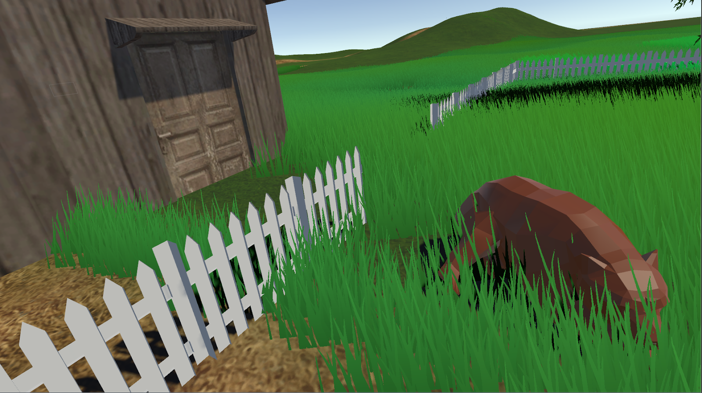

# StayWoke

- [Trailer](https://youtu.be/0YEG7jgNYbs)
- [Gameplay Demo](https://youtu.be/kXlt8Wv5Asw)

## Description
It’s so fun that you can **bear-ly** put it down! 

Stay Woke is a fun-filled game relying on the player’s quick thinking, patience, and handle of the controllers of the Vive headset. The player acts as Goldilocks at the residence of the three bears. The player must escape to the other side of the yard. However, they must pass by a dangerous bear that’s sleeping right in between them and the cabin entrance. 

## Setup
1. Run the SteamVR Standing Room Setup 
2. Open level001.unity 
3. *Bear* the HTC Vive and escape the backyard. 

## How to Play
### Movement
In order to play the game, the player needs to wear the headset and hold both controllers. In order to move around in the backyard, the player can walk or run using either one of the Vive controllers. Pressing the circular button on top of one controller, and waving the corresponding arm in an up and down (starting at a 90 degree angle between the lower and upper arm) fashion, while holding the controller horizontally will move the player forward. The player rotates by turning around physically in place, so as to utilize the directional forward vector being tracked by the headset. In order to move backwards, the player must position the controller vertically in their hands as well as their lower arms, and motion them in a forwards-and-backwards motion. Undergoing all of the aforementioned actions with greater speed will increase the speed of the player’s movement. 

### Resources
There are multiple resources available in the backyard that may or may not assist the player in their escape. The player must use their wits and choose wisely. These resources include various colored cubes, some of which can be used as food that will distract the bear, however, some, if taken from the bear, can aggravate it instead. In order to pick up and throw items, the player can choose the other controller (that isn’t being used to move), and navigate it towards the object. Once the controller is close enough, the object will highlight yellow, indicating that the player can pick it up. The player can then press and hold the trigger button (located on the backside of the controller) in order to pick up and hold the object. 

### Environment
The player can also use the terrain of the backyard to their advantage to hide and run away from the bear. They hide behind trees, as well as crouch down by physically crouching down in place in order to hide behind bushes and in tall grasses. 

## References and Resources

### VRTK A productive VR Toolkit for rapidly building VR solutions in Unity3d

- [Website](http://vrtk.io/)
- [Github](https://github.com/thestonefox/VRTK)
- [Unity Asset](https://www.assetstore.unity3d.com/en/#!/content/64131 )

### Nature Starter Kit 2
- [Unity Asset](https://www.assetstore.unity3d.com/en/#!/content/52977)

### 3D Models
- [Low Poly Bear Model and Animations by Bilalov Radik](https://www.cgtrader.com/billl90)
- [Cabin Model by animatedheaven](https://free3d.com/3d-model/old-farm-house-91130.html)
- [White Picket Fence Model by Azzamatta2551](https://free3d.com/3d-model/old-farm-house-91130.html)
- [Object2Terrain](http://wiki.unity3d.com/index.php?title=Object2Terrain)
- [Terrain by SpeedTutor](https://www.youtube.com/watch?v=v04_Rzu-TGY&)

### Sound Effects
- [Thuds by AllSounds](https://www.youtube.com/watch?v=fWy3WQzeoa8)
- [Bear](https://www.freesoundeffects.com/free-sounds/bears-10017/)

## Contributors
- [Meghana Seshadri](https://github.com/megsesh)
- [Jon Lee](https://github.com/agentlee)
- [Aman Sachan](https://github.com/Aman-Sachan-asach)
 

